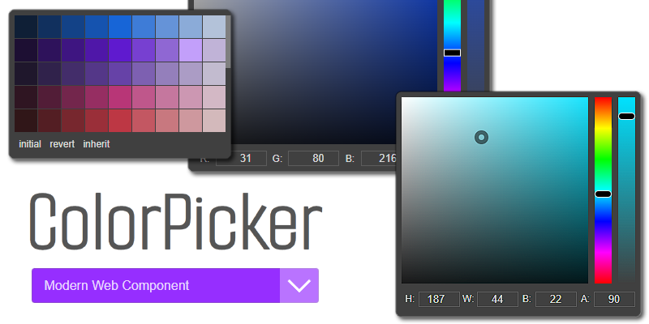

## ColorPicker

[](https://coveralls.io/github/thednp/color-picker)
[](https://github.com/thednp/color-picker/actions/workflows/ci.yml)
[](https://www.jsdelivr.com/package/npm/@thednp/color-picker)
[](https://www.npmjs.com/package/@thednp/color-picker)
[](https://www.typescriptlang.org/)
[](https://github.com/eslint)
[](https://prettier.io/)
[](https://cypress.io/)
[](https://github.com/vitejs)

The feature rich **ColorPicker** component for the modern web, sourced with TypeScript, Cypress tested, WAI-ARIA compliant and lots of goodies. In addition, it features its own version of [TinyColor](https://github.com/bgrins/TinyColor) called simply [Color](http://github.com/thednp/color).

**ColorPicker** can use existing colour palettes or generate custom ones via DATA API configuration. If you want to play, check out [this codepen](https://codepen.io/thednp/pen/WNdRWPN) I've setup for you. Have fun!

[](http://thednp.github.io/color-picker)

## Highlights

- Accessibility Focus for WAI-ARIA compliance
- TypeScript sourced code base
- Framework agnostic and flexible design
- Supporting HEX(a), RGB(a), HSL(a) and HWB, the last three also in CSS4 Color Module flavours
- Supports keyboard and touch events
- Automatic repositioning of the popup dropdown on show / window scroll
- SCSS sources with minimal style required
- Cypress tested
- Right To Left Languages Supported
- light footprint, `10kb` in size when minified and gZipped

## Wiki

For an in depth guide on all things **ColorPicker**, check out the wiki pages:

- [Home](https://github.com/thednp/color-picker/wiki) - the **ColorPicker** wiki home.
- [NPM](https://github.com/thednp/color-picker/wiki/NPM) - quick installation guide.
- [CDN Link](https://github.com/thednp/color-picker/wiki/CDN) - quick implementation guide.
- [Usage](https://github.com/thednp/color-picker/wiki/Usage) - an in-depth browser usage.
- [ES6+](https://github.com/thednp/color-picker/wiki/ES6) - your usual quick ES6+ guide.
- [Node.js](https://github.com/thednp/color-picker/wiki/Node.js) - is this a thing?

## NPM

You can install **ColorPicker** through NPM:

```
$ npm install @thednp/color-picker
```

## Browser Usage

Download the [latest package](https://github.com/thednp/color-picker/archive/master.zip). unpack and inspect the contents. You need to copy the `color-picker.js` and `color-picker.css` or their minified variations to your app `assets` folders as follows.
Link the required CSS in your document `<head>` tag

```html
<link href="../assets/css/color-picker.css" rel="stylesheet" />
```

Link the required JS in your document `<body>` tag, though it should work in the `<head>` as well

```html
<script src="../assets/js/color-picker.js"></script>
```

Now you can initialize the function for your elements at the end of your `<body>` tag

```html
<script>
  var myPicker = new ColorPicker('input.SELECTOR');
</script>
```

To use the DATA-API, you can provide for instance the `data-format="hex"`, and other specific attributes like so:

```html
<label for="myPicker">Color Label</label>
<div class="color-picker">
  <input
    id="myPicker"
    name="myPicker"
    data-function="color-picker"
    data-format="hex"
    data-color-presets="red,green,blue"
    class="color-preview"
    value="#069"
  />
</div>
```

The `data-function="color-picker"` attribute is useful for mass initialization, [check this usage section of the wiki](https://github.com/thednp/color-picker/wiki/Usage#initialize-multiple-targets).

## Initialize INPUT

```javascript
import ColorPicker from '@thednp/color-picker';

const myPicker = new ColorPicker('#myPicker');
```

## Thanks

- Dimitris Grammatikogiannis for his [initial project](https://codepen.io/dgrammatiko/pen/zLvXwR) as well as testing and contributions
- Serhii Kulykov for his [Vanilla Colorful](https://github.com/web-padawan/vanilla-colorful)
- Brian Grinstead for his [TinyColor](https://github.com/bgrins/TinyColor)
- Jonathan Neal for his [convert-colors](https://github.com/jonathantneal/convert-colors)
- Peter Dematté for his [colorPicker](http://www.dematte.at/colorPicker/)
- Ștefan Petre at eyecon for his [colorPicker](https://www.eyecon.ro/colorpicker/)
- Brian Teeman for his [patience](https://github.com/joomla/joomla-cms/pull/35639)

## License

**ColorPicker** is released under the [MIT License](https://github.com/thednp/color-picker/blob/master/LICENSE).
